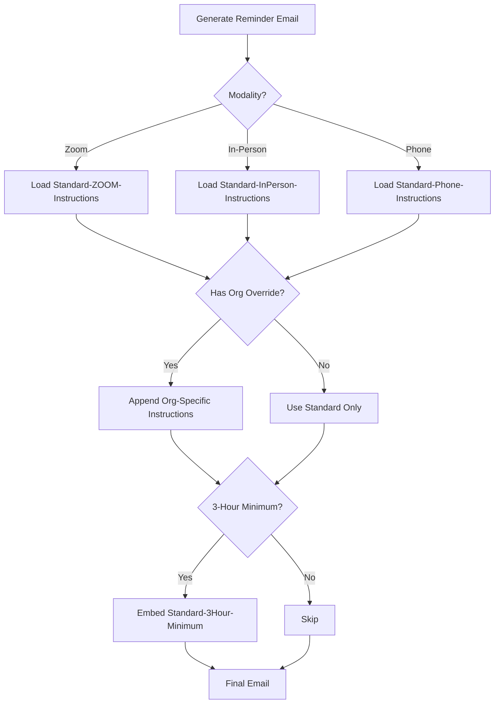

# Config Architecture: How Organization Configs Flow Through The System

**Purpose:** Explain where config lives, how changes flow, and what happens when you edit an org file.

---

## 🗂️ WHERE CONFIG LIVES

### Current State (Today)

```
1. Markdown Files (YOU EDIT THESE)
   📍 Location: INCOME/intercom/Interlingo/instructions/organizations/Org-[Name].md
   📍 Purpose: Human-readable documentation + source of truth
   📍 Example: Org-Kent-Municipal-Court.md

2. n8n Code Nodes (LEGACY - FROZEN)
   📍 Location: n8n workflows (nov.reminders.email, etc.)
   📍 Purpose: Hardcoded instructions that run TODAY
   📍 Problem: Not connected to markdown files
   📍 Status: DO NOT EDIT - will be retired when Interlingo launches

3. Supabase Database (FUTURE - NOT BUILT YET)
   📍 Location: organizations table in Supabase
   📍 Purpose: Will store org configs when Interlingo is ready
   📍 Status: Scaffolding exists, but not connected to workflow yet
```

**The Disconnect:**
- You edit `Org-Kent-Municipal-Court.md` → **Nothing changes in the live system**
- n8n is still running hardcoded instructions from Code nodes
- Markdown files are **documentation only** until Interlingo is built

---

## 🔄 HOW CHANGES FLOW (Current vs Future)

### Today's Workflow (Manual)

```
1. You edit Org-Kent-Municipal-Court.md
   ↓
2. File is saved in Git
   ↓
3. Export to Word doc for Clinton/3rd review
   ↓
4. Clinton/3rd make edits in Word
   ↓
5. You manually update markdown from their edits
   ↓
6. NOTHING HAPPENS IN THE LIVE SYSTEM
   (n8n still runs old instructions)
```

**Why this is okay for now:**
- You're documenting the SOURCE OF TRUTH
- When Interlingo launches, it will read these markdown files (or migrate to Supabase)
- For now, treat markdown as "the real config" even though it's not connected yet

---

### Future Workflow (When Interlingo Is Built)

```
1. You edit Org-Kent-Municipal-Court.md
   ↓
2. Interlingo sync script reads markdown
   ↓
3. Updates Supabase organizations table with new instructions
   ↓
4. Next reminder email generated by Interlingo
   ↓
5. Interlingo pulls org instructions from Supabase
   ↓
6. Email includes updated instructions
```

**Automated flow:**
- Edit markdown once → Database updates → Emails use new instructions
- No more hardcoded n8n nodes
- No more manual duplication

---

## 📋 WHAT HAPPENS WHEN YOU EDIT AN ORG FILE

### Scenario: You update Kent's Zoom check-in instructions

**File: Org-Kent-Municipal-Court.md**

**Change:**
```diff
- Chat: "Language Interpreter present"
+ Chat: "Spanish Interpreter - [Your Name] - Present"
```

**What happens immediately:**
1. ✅ Markdown file updated
2. ✅ Git tracks the change
3. ✅ Obsidian graph view shows Kent → Standard-ZOOM-Instructions relationship
4. ✅ Wikilinks remain functional
5. ❌ n8n workflows **still use old instructions** (not connected)
6. ❌ Supabase database **not updated** (not connected yet)

**What happens when you export to Word:**
1. ✅ Clinton/3rd see updated instructions in Word doc
2. ✅ They can mark up, approve, or reject
3. ✅ You update markdown based on their feedback
4. ❌ Still not live in the system

**What happens when Interlingo launches:**
1. ✅ Interlingo reads markdown file (or migrates to Supabase)
2. ✅ New reminders use updated instructions
3. ✅ No more n8n code editing required
4. ✅ Changes flow automatically: markdown → database → emails

---

## 🧩 HOW WIKILINKS CREATE THE RELATIONSHIP GRAPH

### Example: Kent Org Config

**File structure:**
```
Org-Kent-Municipal-Court.md
   ├─ [[Standard-ZOOM-Instructions]]        ← Base template
   ├─ [[Standard-3Hour-Minimum]]            ← Embedded requirement
   ├─ [[TEMP-REM-Email]]                    ← Email template reference
   └─ [[FRAMEWORK#Process 5]]               ← Links to process doc
```

**What wikilinks do:**
1. **Navigation:** Click `[[Standard-ZOOM-Instructions]]` → jumps to that file
2. **Graph View:** Obsidian shows Kent connects to Standard-ZOOM-Instructions
3. **Transclusion:** `![[Standard-3Hour-Minimum]]` embeds content inline
4. **Change propagation:** Update Standard-ZOOM-Instructions → ALL orgs using it inherit the change

**Example of change propagation:**

**Scenario:** You update Standard-ZOOM-Instructions.md to add a new line:
```diff
+ Please ensure your camera is ON when joining.
```

**What happens:**
- ✅ Kent org config shows this change (via wikilink)
- ✅ Puyallup org config shows this change (via wikilink)
- ✅ ALL orgs using `[[Standard-ZOOM-Instructions]]` inherit the change
- ✅ You changed it once, it updated everywhere

---

## 🏗️ CONFIG HIERARCHY (Inheritance Model)

### How Organization Configs Inherit From Standard Instructions

```
LEVEL 1: Standard Instructions (Base Layer)
   📁 Standard-ZOOM-Instructions.md
   📁 Standard-InPerson-Instructions.md
   📁 Standard-Phone-Instructions.md
   📁 Standard-3Hour-Minimum.md

   ↓ (Organizations inherit these)

LEVEL 2: Organization-Specific Overrides
   📁 Org-Kent-Municipal-Court.md
      ├─ Uses: [[Standard-ZOOM-Instructions]]
      └─ Adds: Kent-specific check-in procedure

   📁 Org-Puyallup-Municipal-Court.md
      ├─ Uses: [[Standard-InPerson-Instructions]]
      ├─ Embeds: [[Standard-3Hour-Minimum]]
      └─ Adds: Puyallup parking instructions
```

**Inheritance logic:**
1. Start with standard instructions (base)
2. Add organization-specific overrides (appended)
3. Result: Base + Org-Specific = Final Email Content

**Example: Puyallup In-Person Reminder**

**Template builds like this:**
```
[Base Instructions from Standard-InPerson-Instructions]
   You are scheduled to appear in person at:

   Puyallup Municipal Court
   1234 Main St, Puyallup, WA 98371

   Please arrive 15 minutes early for security screening.

[3-Hour Minimum from Standard-3Hour-Minimum (embedded)]
   This job is subject to a 3-hour minimum billing policy.

[Org-Specific from Org-Puyallup-Municipal-Court]
   Parking: Public lot on Main St, first 2 hours free with validation.
   Mileage: Reimbursed at $0.67/mile (submit receipts).
```

**Final email = Base + Embedded + Org-Specific**

---

## 🔧 CONDITIONAL LOGIC (How Interlingo Will Handle It)

### Decision Tree for Email Generation



**Interlingo's logic:**
1. Check modality → Load base template
2. Check org config → Append org-specific instructions
3. Check special requirements → Embed conditionals (3-hour min, mileage, etc.)
4. Combine all layers → Generate final email

---

## 📤 EXPORTING FOR CLINTON/3RD (Word Docs)

### Why They Need Word Docs

**Problem:** Clinton/3rd don't use markdown editors
**Solution:** Export markdown to Word for their review

**Workflow:**
1. You edit `Org-Kent-Municipal-Court.md`
2. Export to `Org-Kent-Municipal-Court.docx` (Pandoc or Google Docs)
3. Save to shared cloud storage (OneDrive/Google Drive)
4. Clinton/3rd review and mark up in Word
5. They save changes in cloud
6. You manually apply their edits back to markdown
7. Markdown remains source of truth

**Tools for export:**
- **Pandoc:** `pandoc Org-Kent-Municipal-Court.md -o Org-Kent-Municipal-Court.docx`
- **Obsidian Plugin:** Markdown to Word export
- **Manual:** Copy/paste into Google Docs, export as Word

---

## ✅ SUMMARY: HOW IT ALL WORKS

### Current State (Today)

**Config lives in:**
1. Markdown files (you edit, source of truth)
2. n8n Code nodes (legacy, frozen, will retire)
3. Supabase (scaffolding exists, not connected)

**When you edit markdown:**
- ✅ File updated
- ✅ Git tracks change
- ✅ Wikilinks work
- ❌ Live system unchanged (n8n not connected)
- ❌ Database not updated

**How to review with Clinton/3rd:**
- Export markdown → Word docs
- They review in Word
- You apply edits back to markdown
- Markdown = source of truth

---

### Future State (When Interlingo Launches)

**Config lives in:**
1. Markdown files (still editable, optional)
2. Supabase database (synced from markdown or manual entry)

**When you edit markdown:**
- ✅ File updated
- ✅ Sync script updates Supabase
- ✅ Next reminder email uses new instructions
- ✅ Fully automated

**How to review with Clinton/3rd:**
- Same Word export workflow
- OR: Interlingo admin panel (future)

---

## 🎯 KEY TAKEAWAY

**Right now, markdown files are documentation.**

**In the future, markdown files drive the live system.**

**Edit markdown like it's already live** - because when Interlingo launches, it will be. You're building the source of truth today that will power automation tomorrow.

**Wikilinks create relationships.** Update a standard instruction → all orgs inherit the change.

**Frontmatter creates metadata.** Interlingo will read frontmatter to understand org properties (modalities, special requirements, etc.).

**You're not just documenting - you're building the database in markdown form.**

---

## Related Files

- [[FRAMEWORK#Process 5: Organization Management]]
- [[_ORG-CONFIG-TEMPLATE]]
- [[ORGANIZATION-UUID-MAPPING]]
- [[instructions/standard/]]
- [[templates/]]
