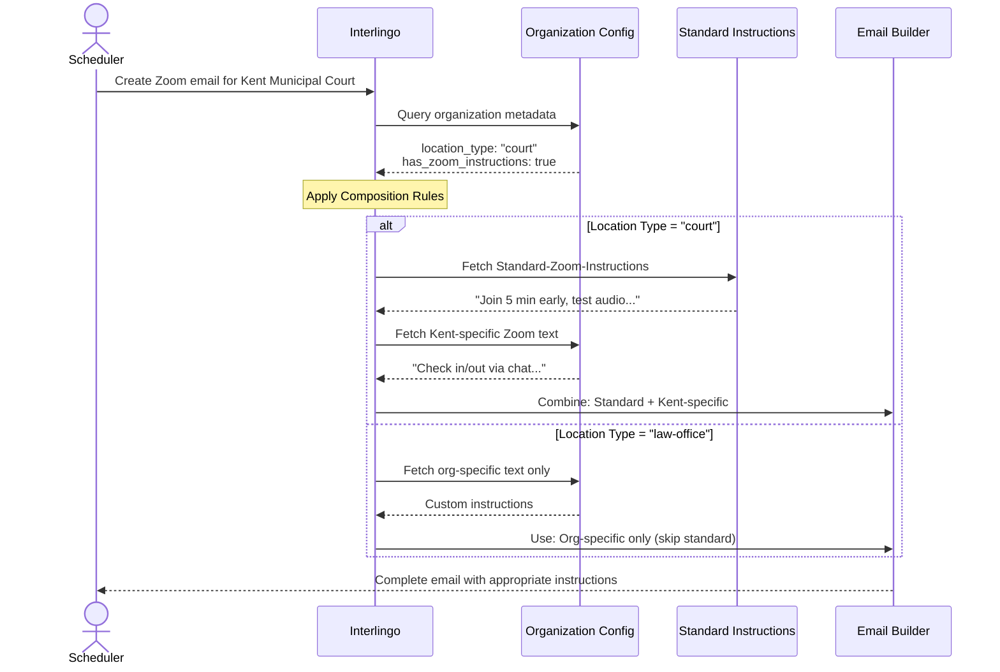
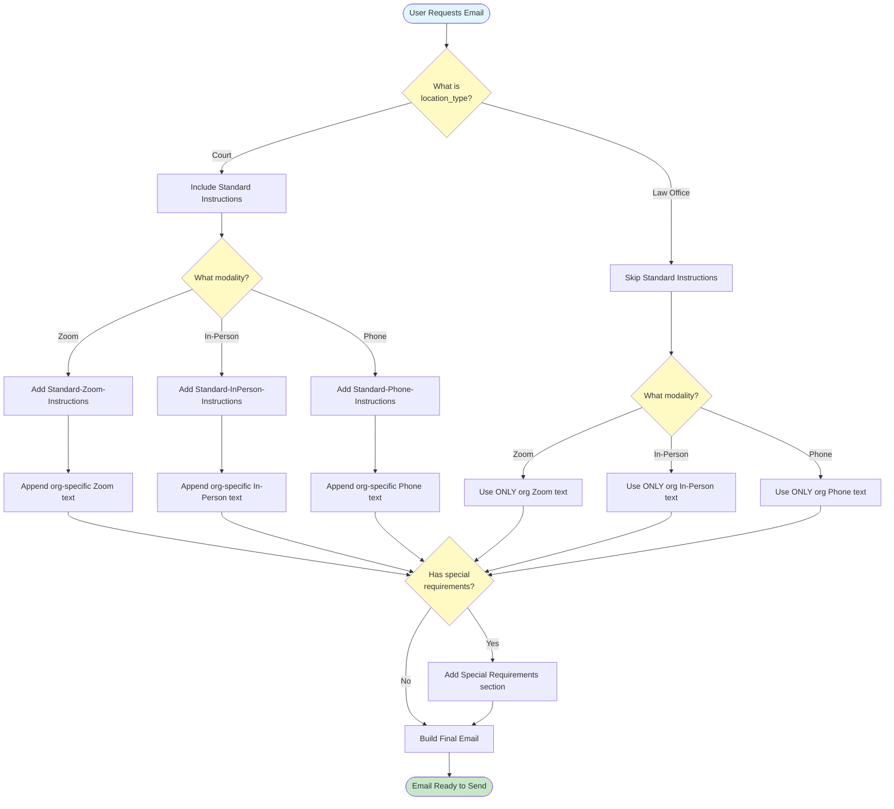
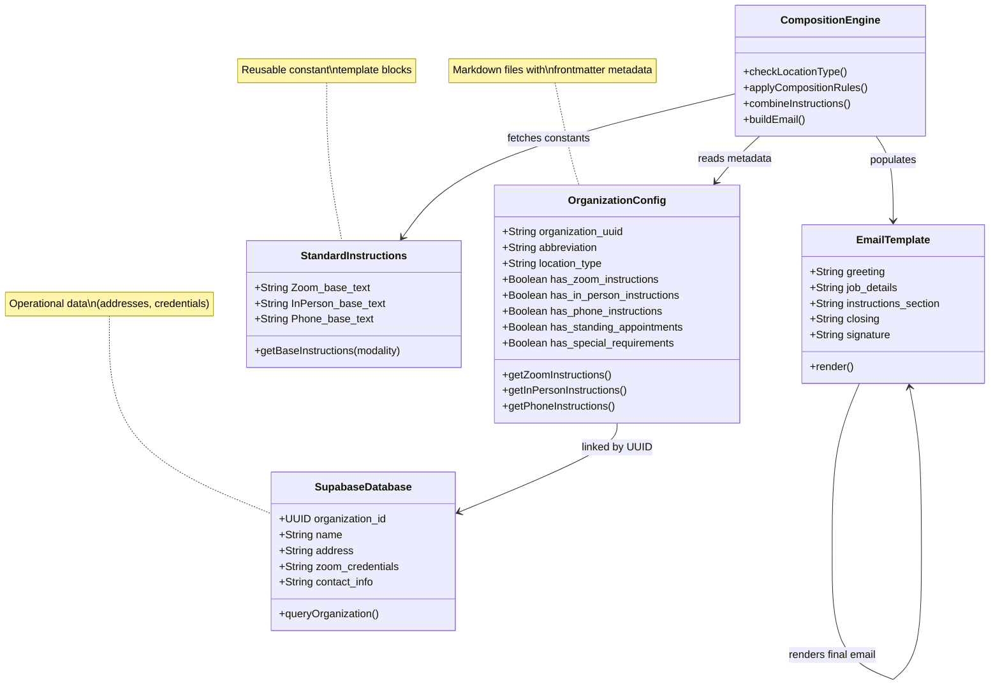

# Organization Config Standardization
## Week of January 13-16, 2026

---

## 📊 Executive Summary

**Objective:** Standardize all organization configuration files using a scalable architecture that separates operational data from workflow instructions.

**Completed:** 7 organization configs updated with new template architecture

**Architecture Redesign:** Implemented 3-layer composition model (Constants + Variables + Logic)

---

## 🎯 The Problem We Solved

### Before: Inconsistent Structure
```
❌ Old frontmatter (inconsistent fields)
❌ Mixed metadata and instructions
❌ No clear separation: data vs procedures
❌ Hardcoded information in multiple places
❌ No database linkage for automation
```

### After: Standardized Architecture
```
✅ Consistent frontmatter with UUID linkage
✅ Operational data → Supabase (addresses, contacts)
✅ Workflow instructions → Markdown (procedures)
✅ Verbatim email content (not metadata)
✅ Wikilink references to standard instructions
```

---

## 🏗️ Architecture: Constants + Variables + Composition Rules

### **Visual: Email Composition Flow (Sequence Diagram)**



**What This Diagram Shows:**

This sequence diagram illustrates the **decision flow** when building an email for a court vs a law office:

**Step 1: Query Organization Metadata**
- System checks the org config file's frontmatter
- Key fields: `location_type`, `has_zoom_instructions`

**Step 2: Apply Composition Rules (The Decision Point)**
- **IF location_type = "court":**
  - ✅ Fetch Standard-Zoom-Instructions (constant)
  - ✅ Fetch Kent-specific text (variable)
  - ✅ **COMBINE THEM** → Standard base text FIRST, then org-specific additions AFTER
  - Result: Two-part instructions (generic + custom)

- **IF location_type = "law-office":**
  - ❌ SKIP Standard-Zoom-Instructions
  - ✅ Fetch org-specific text ONLY (variable)
  - ✅ **USE ALONE** → No standard base, just custom text
  - Result: Custom-only instructions

**Step 3: Build Final Email**
- Email Builder receives either combined or custom-only instructions
- Populates email template with appropriate content

**Yes, We ARE Combining Them (for Courts):**

The "Combine: Standard + Kent-specific" means the email will contain:

```
[Email greeting and job details]

📋 Zoom INSTRUCTIONS:

[Standard-Zoom-Instructions - the constant base]
Join the Zoom meeting 5 minutes early to test your connection.
Ensure you have good lighting and your audio is working...

[Kent-specific additions - the variable]
**IMPORTANT:** Kent Municipal Court requires you to check in and out using the chat.
(1) AS SOON AS you log on, please chat Everyone: "Language Interpreter present"
(2) Before you log off, please chat Everyone: "Language Interpreter finished"

[Rest of email: closing, signature]
```

For law offices like Kirshenbaum & Goss, the standard base is skipped entirely - only custom text appears.

### **Visual: Composition Logic (Flowchart)**



### **Visual: Data Architecture (Class Diagram)**



### **Layer 1: Constants (Building Blocks)**
```
┌─────────────────────────────────────┐
│  Standard-Zoom-Instructions         │  ← Same for all courts
│  Standard-InPerson-Instructions     │  ← Same for all orgs
│  Standard-Phone-Instructions        │  ← Same for all orgs
│  Email Structure (greeting/closing) │  ← Same for all emails
└─────────────────────────────────────┘
```

**Example:** "Join Zoom 5 minutes early, ensure good lighting, test audio"

---

### **Layer 2: Variables (Organization-Specific)**
```
┌──────────────────────────────────────────┐
│  Kent: "Check in/out via Zoom chat"     │
│  Yakima: "Name format: INT H Hughes"    │
│  Fife: "Report mileage by end of day"   │
│  Kirshenbaum: "Call until office answers"│
└──────────────────────────────────────────┘
```

**Example:** "Kent Municipal Court requires you to check in using the chat"

---

### **Layer 3: Composition Rules (Logic)**
```
┌─────────────────────────────────────────────────┐
│  IF location_type = "court"                    │
│    → Include Standard Instructions (constant)  │
│    → THEN append org-specific text (variable)  │
│                                                 │
│  IF location_type = "law-office"               │
│    → SKIP Standard Instructions                │
│    → ONLY use org-specific text (variable)     │
└─────────────────────────────────────────────────┘
```

**Example:** Courts get full instructions, law offices get custom-only

---

## 📦 What We Built

### **7 Organizations Standardized**

| Organization | Type | Key Changes |
|-------------|------|-------------|
| **Fife Municipal Court** | Court | ✅ Restructured from old format<br>✅ Mileage instructions (Pierce County)<br>✅ Phone modality documented<br>⚠️ UUID pending (needs Supabase record) |
| **Kent Municipal Court** | Court | ✅ Cleaned existing frontmatter<br>✅ Added Standing Appointments (Monday Spanish)<br>✅ Calendar minimums documented (2hr/3hr/4hr)<br>✅ Zoom chat check-in protocol |
| **Kirshenbaum & Goss** | Law Office | ✅ Complete rebuild from minimal file<br>✅ Answering service protocol<br>✅ Disposition paperwork handling<br>✅ Zoom verification requirements |
| **Stein-Lotzkar & Starr** | Law Office | ✅ Complete restructure<br>✅ 45-minute phone standby window<br>✅ Attorney-initiated call protocol |
| **Yakima District Court** | Court | ✅ Restructured from old format<br>✅ Zoom name format (INT H Hughes)<br>✅ Removed n8n template code |
| **Yakima Superior Court** | Court | ✅ Rebuilt from scratch<br>✅ Standard Zoom procedures<br>✅ Distinction from District Court noted |
| **Sumner Municipal Court** | Court | ✅ Rebuilt from 46-byte placeholder<br>✅ Thursday standing court day<br>⚠️ Flagged for additional info gathering |

---

## 🔍 Before & After Example: Kent Municipal Court

### **Before (Old Format)**
```yaml
---
date_created: 2025-07-15 13:10
modified: Tuesday 15th July 2025 13:10:29
silo: Language Interpretation Services
"document_type:": Client Specifics
organization_name: Kent Municipal Court
---

## Zoom Instructions:
[Mixed content with inconsistent formatting]
```

### **After (New Architecture)**
```yaml
---
# Document Metadata
created_date: 2025-07-15
last_modified: 2026-01-16
document_type: client_specifics
status: active

# Organization Identity
organization_name: Kent Municipal Court
organization_uuid: ae8ce6f1-5dbb-40dc-8848-7c35a8efec48
abbreviation: KENT
location_type: court

# Database Linkage
database_link: "supabase://organizations/ae8ce6f1..."
supabase_project: anqfdvyhexpxdpgbkgmd

# Classification
tags: [organization-config, court, washington, king-county]
has_zoom_instructions: true
has_standing_appointments: true
---

## Zoom Instructions
**Base:** [[Standard-Zoom-Instructions]]

**Organization-Specific Instructions:**
[Exact email text for Kent's chat check-in procedure]

## Standing Appointments
Monday 10AM-12PM: Spanish attorney-client meetings (Courtroom 4)
```

---

## 📈 Architecture Benefits

### **For Email Generation System**
```
✅ IF (org == "Kent" AND modality == "Zoom"):
     → Standard-Zoom-Instructions (constant)
     → Kent-specific Zoom text (variable)
     → Result: Complete email with base + custom instructions

✅ IF (org == "Kirshenbaum" AND modality == "Zoom"):
     → SKIP Standard-Zoom-Instructions (law office rule)
     → Kirshenbaum-specific text only (variable)
     → Result: Custom-only email without generic base
```

### **For Future Interlingo App**
```
✅ UUID linkage enables database queries
✅ has_zoom_instructions flag → show/hide sections
✅ has_standing_appointments → calendar auto-population
✅ location_type → drives composition logic
✅ Wikilinks → graph view of instruction relationships
```

---

## 🎯 Impact & Next Steps

### **Immediate Value**
- ✅ Consistent structure across all org configs
- ✅ Clear separation: operational data vs workflow instructions
- ✅ Verbatim email content (copy/paste ready)
- ✅ UUID linkage prepared for Interlingo automation

### **Technical Debt Resolved**
- ✅ Eliminated old inconsistent frontmatter
- ✅ Removed hardcoded data (moved to Supabase)
- ✅ Standardized wikilink references
- ✅ Documented composition rules for email generation

### **Remaining Work**
- ⚠️ Create Supabase records for Fife, Stewart MacNichols (missing UUIDs)
- ⚠️ Update Supabase schema (add modalities, tags, special_requirements fields)
- ⚠️ Document Standard-Zoom-Instructions, Standard-InPerson-Instructions files
- ⚠️ Gather additional info for Sumner Municipal Court (minimal config)

---

## 📊 Files Modified

```
✓ Org-Fife-Municipal-Court.md          (restructured, UUID pending)
✓ Org-Kent-Municipal-Court.md          (cleaned + standing appointments)
✓ Org-Kirshenbaum-Goss.md              (complete rebuild)
✓ Org-Stein-Lotzkar-Starr.md           (complete rebuild)
✓ Org-Yakima-District-Court.md         (restructured)
✓ Org-Yakima-Superior-Court.md         (rebuilt from scratch)
✓ Org-Sumner-Municipal-Court.md        (rebuilt from placeholder)
```

**Total:** 7 organization configs standardized with new architecture

---

## 💡 Key Architectural Decisions

1. **Operational Data → Supabase:** Addresses, Zoom credentials, contact info live in database (not markdown)

2. **Workflow Instructions → Markdown:** Procedures, special requirements, email text live in version-controlled files

3. **Verbatim Content Model:** Organization-specific sections contain exact email paragraph text (not metadata descriptions)

4. **Inheritance Model:** Base instructions + org-specific additions (not duplication)

5. **Composition Rules:** `location_type` field determines whether to include standard base instructions

6. **Graph-Ready:** Wikilink references enable Obsidian graph view of instruction relationships

---

## 🔗 Reference Documents

- **Architecture:** `CONFIG-ARCHITECTURE.md` - Full technical specification
- **Template:** `_ORG-CONFIG-TEMPLATE.md` - New organization config pattern
- **UUID Mapping:** `ORGANIZATION-UUID-MAPPING.md` - Database linkage reference
- **Frontmatter Spec:** `FRONTMATTER-TEMPLATE.md` - Required metadata fields
- **Reference Standard:** `Org-Puyallup-Municipal-Court.md` - First fully compliant example

---

## 📅 Timeline

**January 15, 2026:** Architecture redesigned, Puyallup established as reference standard
**January 16, 2026:** 7 remaining org configs updated with new template

**Time Investment:** ~2-3 hours of focused architectural work

**Deliverable:** Scalable, maintainable organization config system ready for Interlingo automation

---

**Prepared by:** Chavvo (Digital Assistant)
**For:** INTERCOM Language Services
**Project:** Interlingo Job Management System
**Date:** January 16, 2026
